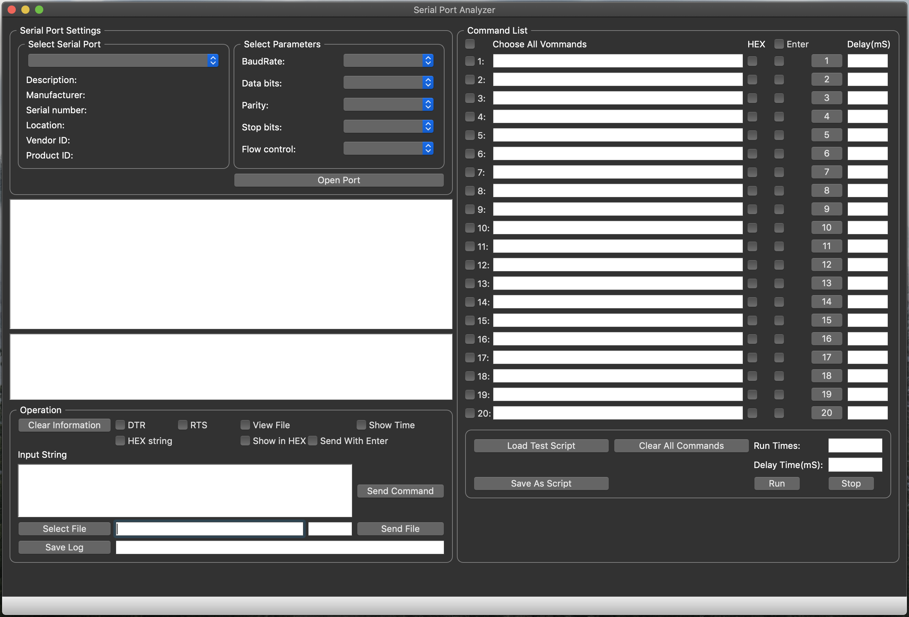

# SPA - Serial Port Analyzer
Cross platform system utility (MacOS X, Linux, Windows) for serial ports monitoring UART RS-232/422/485. 
The program monitors, displays, logs and analyzes all serial port activity in a system. Perfect software solution for serial port monitoring.

### Keywords:

Free serial monitor
free serial port monitor
serial analyzer
serial com port monitor
serial data analyzer
serial data logger
serial data monitor 
serial logger
serial monitor 
serial port analyser
serial port data logger
serial port logger 
serial port monitor 
serial port monitor download
serial port monitor software
serial port monitoring  
virtual serial port monitor
windows port monitor
windows serial port monitor 
com monitor
com port analyzer
com port logger
com port monitor
com port monitoring software
comm port monitor
monitor com port
port monitor
com port data logger
download com port monitor

 
Just starting create